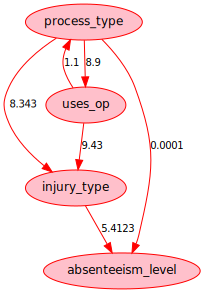
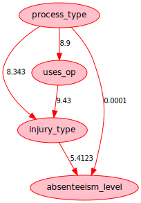
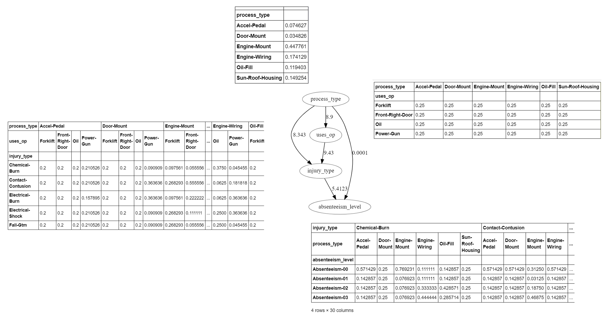

```python

```


```python
import os
from typing import *


os.getcwd()
# Setting the baseline:
os.chdir('/development/projects/statisticallyfit/github/learningmathstat/PythonNeuralNetNLP')


curPath: str = os.getcwd() + "/src/CausalNexStudy/"

dataPath: str = curPath + "data/"


print("curPath = ", curPath, "\n")
print("dataPath = ", dataPath, "\n")
```

    curPath =  /development/projects/statisticallyfit/github/learningmathstat/PythonNeuralNetNLP/src/CausalNexStudy/ 
    
    dataPath =  /development/projects/statisticallyfit/github/learningmathstat/PythonNeuralNetNLP/src/CausalNexStudy/data/ 
    


```python
import sys
# Making files in utils folder visible here: to import my local print functions for nn.Module objects
sys.path.append(os.getcwd() + "/src/utils/")
# For being able to import files within CausalNex folder
sys.path.append(curPath)

sys.path
```


    ['/development/projects/statisticallyfit/github/learningmathstat/PythonNeuralNetNLP/src/CausalNexStudy',
     '/development/bin/python/conda3_ana/envs/pybayesian_env/lib/python37.zip',
     '/development/bin/python/conda3_ana/envs/pybayesian_env/lib/python3.7',
     '/development/bin/python/conda3_ana/envs/pybayesian_env/lib/python3.7/lib-dynload',
     '',
     '/development/bin/python/conda3_ana/envs/pybayesian_env/lib/python3.7/site-packages',
     '/development/bin/python/conda3_ana/envs/pybayesian_env/lib/python3.7/site-packages/IPython/extensions',
     '/home/statisticallyfit/.ipython',
     '/development/projects/statisticallyfit/github/learningmathstat/PythonNeuralNetNLP/src/utils/',
     '/development/projects/statisticallyfit/github/learningmathstat/PythonNeuralNetNLP/src/CausalNexStudy/']


```python
from causalnex.structure import StructureModel

model: StructureModel = StructureModel()

model.add_weighted_edges_from([
    ('process_type', 'injury_type', 8.343),
    ('uses_op', 'injury_type', 9.43),
    ('injury_type', 'absenteeism_level', 5.4123),

    ('process_type', 'absenteeism_level', 0.0001),
    ('process_type', 'uses_op', 8.9),
    ('uses_op', 'process_type', 1.1)
])
```

Now visualize:


```python
from IPython.display import Image
from causalnex.plots import plot_structure, NODE_STYLE, EDGE_STYLE

# Now visualize it:
viz = plot_structure(
    model,
    graph_attributes={"scale": "0.5"},
    all_node_attributes=NODE_STYLE.WEAK,
    all_edge_attributes=EDGE_STYLE.WEAK)
filename_demo = curPath + "demo.png"


viz.draw(filename_demo)
Image(filename_demo)
```

    /development/bin/python/conda3_ana/envs/pybayesian_env/lib/python3.7/site-packages/pygraphviz/agraph.py:1367: RuntimeWarning: Warning: node 'process_type', graph '%3' size too small for label
    Warning: node 'injury_type', graph '%3' size too small for label
    Warning: node 'uses_op', graph '%3' size too small for label
    Warning: node 'absenteeism_level', graph '%3' size too small for label
    
      warnings.warn(b"".join(errors).decode(self.encoding), RuntimeWarning)


Showing with graphviz (my function)


```python
from src.utils.VisualUtil import *

renderGraph(weightedGraph = model)
```





Showing the nodes:


```python
model.nodes
```


    NodeView(('process_type', 'injury_type', 'uses_op', 'absenteeism_level'))


Showing the unique edges, which takes into account bidirectionality, as we see there is an edge from `process_type` --> `uses_op` and vice versa:


```python
model.edges
```


    OutEdgeView([('process_type', 'injury_type'), ('process_type', 'absenteeism_level'), ('process_type', 'uses_op'), ('injury_type', 'absenteeism_level'), ('uses_op', 'injury_type'), ('uses_op', 'process_type')])


Seeing the adjacency graph:


```python
model.adj
```


    AdjacencyView({'process_type': {'injury_type': {'origin': 'unknown', 'weight': 8.343}, 'absenteeism_level': {'origin': 'unknown', 'weight': 0.0001}, 'uses_op': {'origin': 'unknown', 'weight': 8.9}}, 'injury_type': {'absenteeism_level': {'origin': 'unknown', 'weight': 5.4123}}, 'uses_op': {'injury_type': {'origin': 'unknown', 'weight': 9.43}, 'process_type': {'origin': 'unknown', 'weight': 1.1}}, 'absenteeism_level': {}})


Must remove one edge from the nodes `process_type` --> `uses_op` because the `BayesianNetwork` class must take an a directed **acyclic** graph:


```python
#from src.utils.VisualUtil import *

PLAY_FONT_NAME: str = 'Play-Regular.ttf'
PLAY_FONT_PATH = curPath + 'fonts/' + PLAY_FONT_NAME

INRIA_FONT_NAME: str = 'InriaSans-Regular'
INRIA_FONT_PATH = curPath + 'fonts/' #+ INRIA_FONT_NAME

ACME_FONT_NAME: str = 'Acme-Regular.ttf'
ACME_FONT_PATH: str = curPath + 'fonts/acme' #+ ACME_FONT_NAME
ACME_FONT_PATH


def renderGraph(weightedGraph: StructureModel) -> gz.Digraph:
    g = gz.Digraph('G')

    adjacencies: List[Tuple[Variable, Dict[Variable, WeightInfo]]] = list(weightedGraph.adjacency())

    for headNode, edgeDict in adjacencies:
        edgeList: List[Variable, WeightInfo] = list(edgeDict.items())

        for tailNode, weightInfoDict in edgeList:
            g.attr('node', shape='oval', color='red')

            g.node(headNode, headNode) # name, label   # variables[head]['desc'])
            g.node(tailNode, tailNode) # name, label
            g.node_attr.update(style = 'filled', fillcolor = 'pink',
                               fontsize = '12',
                               fontpath = ACME_FONT_PATH,
                               fontname = ACME_FONT_NAME) # + '.otf')

            # Setting weighted edge here
            g.edge(tail_name = headNode, head_name = tailNode,label = str(weightInfoDict['weight']))
            g.edge_attr.update(color = 'red', fontsize = '10', fontpath = PLAY_FONT_NAME, fontname = PLAY_FONT_NAME)

    return g

modelAcyclic: StructureModel = model.copy()
modelAcyclic.remove_edge(u = 'uses_op', v = 'process_type')

renderGraph(weightedGraph = modelAcyclic)
```





Fit the bayesian network. No need to create the `StructureModel` from data because we created it by hand and have already set its edge weights.


```python
from causalnex.network import BayesianNetwork

bayesNet: BayesianNetwork = BayesianNetwork(modelAcyclic)
```

Fitting node states, using the input data:


```python
import pandas as pd
from pandas.core.frame import DataFrame

from src.utils.DataUtil import *

inputData: DataFrame = pd.read_csv(dataPath + 'combData_tweak1.csv', delimiter = ',') #, keep_default_na=False)

data = cleanData(inputData.dropna())  # remove the NA rows (which are the empty ones) and clean the whitespaces

data
```


<div>
<style scoped>
    .dataframe tbody tr th:only-of-type {
        vertical-align: middle;
    }

    .dataframe tbody tr th {
        vertical-align: top;
    }

    .dataframe thead th {
        text-align: right;
    }
</style>
<table border="1" class="dataframe">
  <thead>
    <tr style="text-align: right;">
      <th></th>
      <th>process_type</th>
      <th>uses_op</th>
      <th>injury_type</th>
      <th>absenteeism_level</th>
    </tr>
  </thead>
  <tbody>
    <tr>
      <th>0</th>
      <td>Engine-Mount</td>
      <td>Power-Gun</td>
      <td>Electrical-Burn</td>
      <td>Absenteeism-01</td>
    </tr>
    <tr>
      <th>1</th>
      <td>Engine-Mount</td>
      <td>Power-Gun</td>
      <td>Electrical-Burn</td>
      <td>Absenteeism-01</td>
    </tr>
    <tr>
      <th>2</th>
      <td>Engine-Mount</td>
      <td>Power-Gun</td>
      <td>Electrical-Burn</td>
      <td>Absenteeism-02</td>
    </tr>
    <tr>
      <th>3</th>
      <td>Engine-Mount</td>
      <td>Power-Gun</td>
      <td>Electrical-Burn</td>
      <td>Absenteeism-02</td>
    </tr>
    <tr>
      <th>4</th>
      <td>Engine-Mount</td>
      <td>Power-Gun</td>
      <td>Electrical-Burn</td>
      <td>Absenteeism-00</td>
    </tr>
    <tr>
      <th>...</th>
      <td>...</td>
      <td>...</td>
      <td>...</td>
      <td>...</td>
    </tr>
    <tr>
      <th>239</th>
      <td>Door-Mount</td>
      <td>Power-Gun</td>
      <td>Electrical-Burn</td>
      <td>Absenteeism-01</td>
    </tr>
    <tr>
      <th>240</th>
      <td>Door-Mount</td>
      <td>Power-Gun</td>
      <td>Electrical-Burn</td>
      <td>Absenteeism-01</td>
    </tr>
    <tr>
      <th>242</th>
      <td>Door-Mount</td>
      <td>Power-Gun</td>
      <td>Contact-Contusion</td>
      <td>Absenteeism-00</td>
    </tr>
    <tr>
      <th>243</th>
      <td>Door-Mount</td>
      <td>Power-Gun</td>
      <td>Contact-Contusion</td>
      <td>Absenteeism-00</td>
    </tr>
    <tr>
      <th>244</th>
      <td>Door-Mount</td>
      <td>Power-Gun</td>
      <td>Contact-Contusion</td>
      <td>Absenteeism-00</td>
    </tr>
  </tbody>
</table>
<p>195 rows × 4 columns</p>
</div>


Fit all node states:


```python
# bayesNet = bayes
bayesNet.fit_node_states(df = data)
bayesNet.node_states
```


    {'process_type': {'Accel-Pedal',
      'Door-Mount',
      'Engine-Mount',
      'Engine-Wiring',
      'Oil-Fill',
      'Sun-Roof-Housing'},
     'uses_op': {'Forklift', 'Front-Right-Door', 'Oil', 'Power-Gun'},
     'injury_type': {'Chemical-Burn',
      'Contact-Contusion',
      'Electrical-Burn',
      'Electrical-Shock',
      'Fall-Gtm'},
     'absenteeism_level': {'Absenteeism-00',
      'Absenteeism-01',
      'Absenteeism-02',
      'Absenteeism-03'}}


Fitting the conditional probability distributions


```python
bayesNet.fit_cpds(data, method="BayesianEstimator", bayes_prior="K2")
```

    /development/bin/python/conda3_ana/envs/pybayesian_env/lib/python3.7/site-packages/pandas/core/generic.py:5191: FutureWarning: Attribute 'is_copy' is deprecated and will be removed in a future version.
      object.__getattribute__(self, name)
    /development/bin/python/conda3_ana/envs/pybayesian_env/lib/python3.7/site-packages/pandas/core/generic.py:5192: FutureWarning: Attribute 'is_copy' is deprecated and will be removed in a future version.
      return object.__setattr__(self, name, value)
    /development/bin/python/conda3_ana/envs/pybayesian_env/lib/python3.7/site-packages/pgmpy/estimators/base.py:54: FutureWarning: 
    .ix is deprecated. Please use
    .loc for label based indexing or
    .iloc for positional indexing
    
    See the documentation here:
    http://pandas.pydata.org/pandas-docs/stable/user_guide/indexing.html#ix-indexer-is-deprecated
      states = sorted(list(self.data.ix[:, variable].dropna().unique()))
    /development/bin/python/conda3_ana/envs/pybayesian_env/lib/python3.7/site-packages/pgmpy/estimators/base.py:111: FutureWarning: 
    .ix is deprecated. Please use
    .loc for label based indexing or
    .iloc for positional indexing
    
    See the documentation here:
    http://pandas.pydata.org/pandas-docs/stable/user_guide/indexing.html#ix-indexer-is-deprecated
      state_count_data = data.ix[:, variable].value_counts()


    <causalnex.network.network.BayesianNetwork at 0x7f725396c290>


The learned bayesian network still stores the underlying `StructureModel` and the edge values are the same as before - they are just edge **weights** and not edge **probabilities**.


```python
list(bayesNet.structure.adjacency())
```


    [('process_type',
      {'injury_type': {'origin': 'unknown', 'weight': 8.343},
       'absenteeism_level': {'origin': 'unknown', 'weight': 0.0001},
       'uses_op': {'origin': 'unknown', 'weight': 8.9}}),
     ('injury_type',
      {'absenteeism_level': {'origin': 'unknown', 'weight': 5.4123}}),
     ('uses_op', {'injury_type': {'origin': 'unknown', 'weight': 9.43}}),
     ('absenteeism_level', {})]


Showing the graph again for reference


```python

renderGraph(weightedGraph = modelAcyclic)
```


Because `process_type` has no incoming nodes, only outgoing nodes, its conditional distribution is also its *fully* marginal distribution - it is not conditional on any other variable.


```python
bayesNet.cpds['process_type']
```


<div>
<style scoped>
    .dataframe tbody tr th:only-of-type {
        vertical-align: middle;
    }

    .dataframe tbody tr th {
        vertical-align: top;
    }

    .dataframe thead th {
        text-align: right;
    }
</style>
<table border="1" class="dataframe">
  <thead>
    <tr style="text-align: right;">
      <th></th>
      <th></th>
    </tr>
    <tr>
      <th>process_type</th>
      <th></th>
    </tr>
  </thead>
  <tbody>
    <tr>
      <th>Accel-Pedal</th>
      <td>0.074627</td>
    </tr>
    <tr>
      <th>Door-Mount</th>
      <td>0.034826</td>
    </tr>
    <tr>
      <th>Engine-Mount</th>
      <td>0.447761</td>
    </tr>
    <tr>
      <th>Engine-Wiring</th>
      <td>0.174129</td>
    </tr>
    <tr>
      <th>Oil-Fill</th>
      <td>0.119403</td>
    </tr>
    <tr>
      <th>Sun-Roof-Housing</th>
      <td>0.149254</td>
    </tr>
  </tbody>
</table>
</div>


But `uses_op` has `process_type` as an incoming node, so its conditional distribution shows the values of `uses_op` conditional on values of `process_type`:


```python
bayesNet.cpds['uses_op']
```


<div>
<style scoped>
    .dataframe tbody tr th:only-of-type {
        vertical-align: middle;
    }

    .dataframe tbody tr th {
        vertical-align: top;
    }

    .dataframe thead tr th {
        text-align: left;
    }

    .dataframe thead tr:last-of-type th {
        text-align: right;
    }
</style>
<table border="1" class="dataframe">
  <thead>
    <tr>
      <th>process_type</th>
      <th>Accel-Pedal</th>
      <th>Door-Mount</th>
      <th>Engine-Mount</th>
      <th>Engine-Wiring</th>
      <th>Oil-Fill</th>
      <th>Sun-Roof-Housing</th>
    </tr>
    <tr>
      <th>uses_op</th>
      <th></th>
      <th></th>
      <th></th>
      <th></th>
      <th></th>
      <th></th>
    </tr>
  </thead>
  <tbody>
    <tr>
      <th>Forklift</th>
      <td>0.25</td>
      <td>0.25</td>
      <td>0.25</td>
      <td>0.25</td>
      <td>0.25</td>
      <td>0.25</td>
    </tr>
    <tr>
      <th>Front-Right-Door</th>
      <td>0.25</td>
      <td>0.25</td>
      <td>0.25</td>
      <td>0.25</td>
      <td>0.25</td>
      <td>0.25</td>
    </tr>
    <tr>
      <th>Oil</th>
      <td>0.25</td>
      <td>0.25</td>
      <td>0.25</td>
      <td>0.25</td>
      <td>0.25</td>
      <td>0.25</td>
    </tr>
    <tr>
      <th>Power-Gun</th>
      <td>0.25</td>
      <td>0.25</td>
      <td>0.25</td>
      <td>0.25</td>
      <td>0.25</td>
      <td>0.25</td>
    </tr>
  </tbody>
</table>
</div>


`injury_type` is conditional on two variables, and its table reflects this:


```python
bayesNet.cpds['injury_type']
```


<div>
<style scoped>
    .dataframe tbody tr th:only-of-type {
        vertical-align: middle;
    }

    .dataframe tbody tr th {
        vertical-align: top;
    }

    .dataframe thead tr th {
        text-align: left;
    }

    .dataframe thead tr:last-of-type th {
        text-align: right;
    }
</style>
<table border="1" class="dataframe">
  <thead>
    <tr>
      <th>process_type</th>
      <th colspan="4" halign="left">Accel-Pedal</th>
      <th colspan="4" halign="left">Door-Mount</th>
      <th colspan="2" halign="left">Engine-Mount</th>
      <th>...</th>
      <th colspan="2" halign="left">Engine-Wiring</th>
      <th colspan="4" halign="left">Oil-Fill</th>
      <th colspan="4" halign="left">Sun-Roof-Housing</th>
    </tr>
    <tr>
      <th>uses_op</th>
      <th>Forklift</th>
      <th>Front-Right-Door</th>
      <th>Oil</th>
      <th>Power-Gun</th>
      <th>Forklift</th>
      <th>Front-Right-Door</th>
      <th>Oil</th>
      <th>Power-Gun</th>
      <th>Forklift</th>
      <th>Front-Right-Door</th>
      <th>...</th>
      <th>Oil</th>
      <th>Power-Gun</th>
      <th>Forklift</th>
      <th>Front-Right-Door</th>
      <th>Oil</th>
      <th>Power-Gun</th>
      <th>Forklift</th>
      <th>Front-Right-Door</th>
      <th>Oil</th>
      <th>Power-Gun</th>
    </tr>
    <tr>
      <th>injury_type</th>
      <th></th>
      <th></th>
      <th></th>
      <th></th>
      <th></th>
      <th></th>
      <th></th>
      <th></th>
      <th></th>
      <th></th>
      <th></th>
      <th></th>
      <th></th>
      <th></th>
      <th></th>
      <th></th>
      <th></th>
      <th></th>
      <th></th>
      <th></th>
      <th></th>
    </tr>
  </thead>
  <tbody>
    <tr>
      <th>Chemical-Burn</th>
      <td>0.2</td>
      <td>0.2</td>
      <td>0.2</td>
      <td>0.210526</td>
      <td>0.2</td>
      <td>0.2</td>
      <td>0.2</td>
      <td>0.090909</td>
      <td>0.097561</td>
      <td>0.055556</td>
      <td>...</td>
      <td>0.3750</td>
      <td>0.045455</td>
      <td>0.2</td>
      <td>0.2</td>
      <td>0.071429</td>
      <td>0.210526</td>
      <td>0.047619</td>
      <td>0.2</td>
      <td>0.2</td>
      <td>0.055556</td>
    </tr>
    <tr>
      <th>Contact-Contusion</th>
      <td>0.2</td>
      <td>0.2</td>
      <td>0.2</td>
      <td>0.210526</td>
      <td>0.2</td>
      <td>0.2</td>
      <td>0.2</td>
      <td>0.363636</td>
      <td>0.268293</td>
      <td>0.555556</td>
      <td>...</td>
      <td>0.0625</td>
      <td>0.181818</td>
      <td>0.2</td>
      <td>0.2</td>
      <td>0.285714</td>
      <td>0.210526</td>
      <td>0.333333</td>
      <td>0.2</td>
      <td>0.2</td>
      <td>0.222222</td>
    </tr>
    <tr>
      <th>Electrical-Burn</th>
      <td>0.2</td>
      <td>0.2</td>
      <td>0.2</td>
      <td>0.157895</td>
      <td>0.2</td>
      <td>0.2</td>
      <td>0.2</td>
      <td>0.363636</td>
      <td>0.097561</td>
      <td>0.222222</td>
      <td>...</td>
      <td>0.0625</td>
      <td>0.363636</td>
      <td>0.2</td>
      <td>0.2</td>
      <td>0.500000</td>
      <td>0.157895</td>
      <td>0.190476</td>
      <td>0.2</td>
      <td>0.2</td>
      <td>0.444444</td>
    </tr>
    <tr>
      <th>Electrical-Shock</th>
      <td>0.2</td>
      <td>0.2</td>
      <td>0.2</td>
      <td>0.210526</td>
      <td>0.2</td>
      <td>0.2</td>
      <td>0.2</td>
      <td>0.090909</td>
      <td>0.268293</td>
      <td>0.111111</td>
      <td>...</td>
      <td>0.2500</td>
      <td>0.363636</td>
      <td>0.2</td>
      <td>0.2</td>
      <td>0.071429</td>
      <td>0.210526</td>
      <td>0.047619</td>
      <td>0.2</td>
      <td>0.2</td>
      <td>0.222222</td>
    </tr>
    <tr>
      <th>Fall-Gtm</th>
      <td>0.2</td>
      <td>0.2</td>
      <td>0.2</td>
      <td>0.210526</td>
      <td>0.2</td>
      <td>0.2</td>
      <td>0.2</td>
      <td>0.090909</td>
      <td>0.268293</td>
      <td>0.055556</td>
      <td>...</td>
      <td>0.2500</td>
      <td>0.045455</td>
      <td>0.2</td>
      <td>0.2</td>
      <td>0.071429</td>
      <td>0.210526</td>
      <td>0.380952</td>
      <td>0.2</td>
      <td>0.2</td>
      <td>0.055556</td>
    </tr>
  </tbody>
</table>
<p>5 rows × 24 columns</p>
</div>


`absenteeism_level` is only **directly** conditional on two variables, the `injury_type` and `process_type`, which is visible in its conditional probability distribution table below:


```python
bayesNet.cpds['absenteeism_level']
```


<div>
<style scoped>
    .dataframe tbody tr th:only-of-type {
        vertical-align: middle;
    }

    .dataframe tbody tr th {
        vertical-align: top;
    }

    .dataframe thead tr th {
        text-align: left;
    }

    .dataframe thead tr:last-of-type th {
        text-align: right;
    }
</style>
<table border="1" class="dataframe">
  <thead>
    <tr>
      <th>injury_type</th>
      <th colspan="6" halign="left">Chemical-Burn</th>
      <th colspan="4" halign="left">Contact-Contusion</th>
      <th>...</th>
      <th colspan="4" halign="left">Electrical-Shock</th>
      <th colspan="6" halign="left">Fall-Gtm</th>
    </tr>
    <tr>
      <th>process_type</th>
      <th>Accel-Pedal</th>
      <th>Door-Mount</th>
      <th>Engine-Mount</th>
      <th>Engine-Wiring</th>
      <th>Oil-Fill</th>
      <th>Sun-Roof-Housing</th>
      <th>Accel-Pedal</th>
      <th>Door-Mount</th>
      <th>Engine-Mount</th>
      <th>Engine-Wiring</th>
      <th>...</th>
      <th>Engine-Mount</th>
      <th>Engine-Wiring</th>
      <th>Oil-Fill</th>
      <th>Sun-Roof-Housing</th>
      <th>Accel-Pedal</th>
      <th>Door-Mount</th>
      <th>Engine-Mount</th>
      <th>Engine-Wiring</th>
      <th>Oil-Fill</th>
      <th>Sun-Roof-Housing</th>
    </tr>
    <tr>
      <th>absenteeism_level</th>
      <th></th>
      <th></th>
      <th></th>
      <th></th>
      <th></th>
      <th></th>
      <th></th>
      <th></th>
      <th></th>
      <th></th>
      <th></th>
      <th></th>
      <th></th>
      <th></th>
      <th></th>
      <th></th>
      <th></th>
      <th></th>
      <th></th>
      <th></th>
      <th></th>
    </tr>
  </thead>
  <tbody>
    <tr>
      <th>Absenteeism-00</th>
      <td>0.571429</td>
      <td>0.25</td>
      <td>0.769231</td>
      <td>0.111111</td>
      <td>0.142857</td>
      <td>0.25</td>
      <td>0.571429</td>
      <td>0.571429</td>
      <td>0.31250</td>
      <td>0.571429</td>
      <td>...</td>
      <td>0.125000</td>
      <td>0.071429</td>
      <td>0.142857</td>
      <td>0.142857</td>
      <td>0.571429</td>
      <td>0.25</td>
      <td>0.3</td>
      <td>0.571429</td>
      <td>0.571429</td>
      <td>0.090909</td>
    </tr>
    <tr>
      <th>Absenteeism-01</th>
      <td>0.142857</td>
      <td>0.25</td>
      <td>0.076923</td>
      <td>0.111111</td>
      <td>0.142857</td>
      <td>0.25</td>
      <td>0.142857</td>
      <td>0.142857</td>
      <td>0.03125</td>
      <td>0.142857</td>
      <td>...</td>
      <td>0.291667</td>
      <td>0.071429</td>
      <td>0.142857</td>
      <td>0.142857</td>
      <td>0.142857</td>
      <td>0.25</td>
      <td>0.1</td>
      <td>0.142857</td>
      <td>0.142857</td>
      <td>0.181818</td>
    </tr>
    <tr>
      <th>Absenteeism-02</th>
      <td>0.142857</td>
      <td>0.25</td>
      <td>0.076923</td>
      <td>0.333333</td>
      <td>0.428571</td>
      <td>0.25</td>
      <td>0.142857</td>
      <td>0.142857</td>
      <td>0.18750</td>
      <td>0.142857</td>
      <td>...</td>
      <td>0.291667</td>
      <td>0.285714</td>
      <td>0.428571</td>
      <td>0.285714</td>
      <td>0.142857</td>
      <td>0.25</td>
      <td>0.1</td>
      <td>0.142857</td>
      <td>0.142857</td>
      <td>0.363636</td>
    </tr>
    <tr>
      <th>Absenteeism-03</th>
      <td>0.142857</td>
      <td>0.25</td>
      <td>0.076923</td>
      <td>0.444444</td>
      <td>0.285714</td>
      <td>0.25</td>
      <td>0.142857</td>
      <td>0.142857</td>
      <td>0.46875</td>
      <td>0.142857</td>
      <td>...</td>
      <td>0.291667</td>
      <td>0.571429</td>
      <td>0.285714</td>
      <td>0.428571</td>
      <td>0.142857</td>
      <td>0.25</td>
      <td>0.5</td>
      <td>0.142857</td>
      <td>0.142857</td>
      <td>0.363636</td>
    </tr>
  </tbody>
</table>
<p>4 rows × 30 columns</p>
</div>


```python
# Showing the final rendered graph with the conditional probability distributions alongside the nodes:
```


```python
Image(filename = curPath + 'modelWithCPDs.png')
```





